# Barcodes

Makes one barcode of every kind `std.barcodes` knows, saves each as an image, then loads the image back and checks that the barcode found in it holds the text it was made from. The images below are this example's output.

```bash
adm run encoding/barcodes/main.adm                # writes into barcodes-out/
adm run encoding/barcodes/main.adm -- some/dir    # writes into some/dir
```

Making a barcode and reading one are a call each, in [main.adm](main.adm):

```adm
let symbol = try encode("https://adm-lang.dev", Symbology.Qr)
try symbol.toImage(scale = 5).save("qr.png")

for let (_, found) in decode(try load("qr.png")) {
	println("{found.symbology}: {found.text}")
}
```

## Two-dimensional codes

| Kind | Text | Image |
|------|------|-------|
| QR | `https://adm-lang.dev/?from=barcodes` | 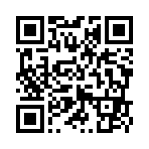 |
| Micro QR | `ADM 2026` | 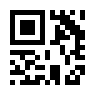 |
| Data Matrix | `Data Matrix: 0123456789` | 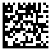 |
| Aztec | `Aztec Code, hello!` | 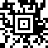 |
| PDF417 | `PDF417 carries whole paragraphs of text.` | 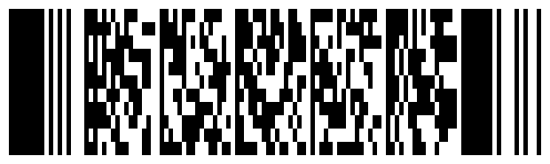 |
| MicroPDF417 | `MicroPDF417` | 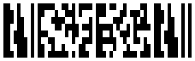 |

## Linear codes

| Kind | Text | Image |
|------|------|-------|
| EAN-13 | `5901234123457` | 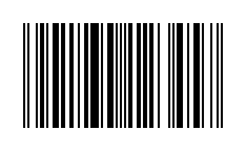 |
| EAN-8 | `96385074` | 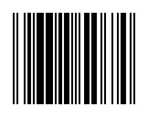 |
| UPC-A | `036000291452` | 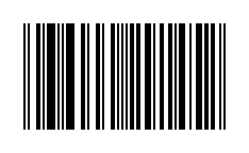 |
| UPC-E | `01234565` | 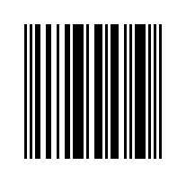 |
| Code 128 | `Code 128 / ADM` | 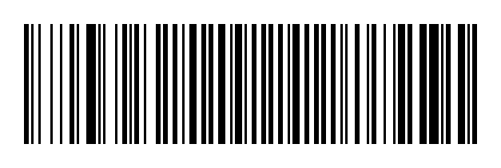 |
| Code 39 | `CODE 39` | 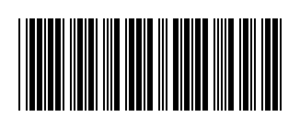 |
| Code 93 | `Code 93!` |  |
| ITF | `12345670` |  |
| Codabar | `A40156B` | 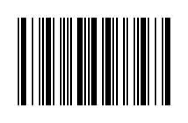 |

## Read back from a JPEG

JPEG is lossy, so its blurred edges test the reader. This QR code holds `Read back from a JPEG`, with a higher error correction level:

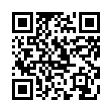

## Several barcodes in one image

`decode` finds every barcode in an image. This sheet holds a QR code, a Data Matrix code, an Aztec code and a Code 128 barcode, and one call reads all four:

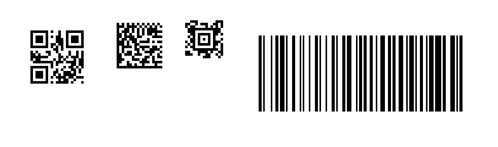
