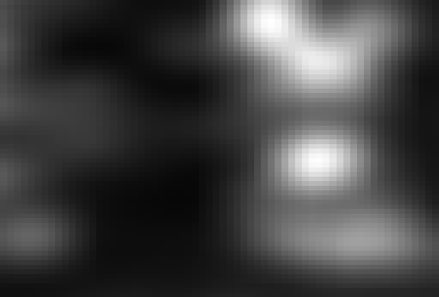
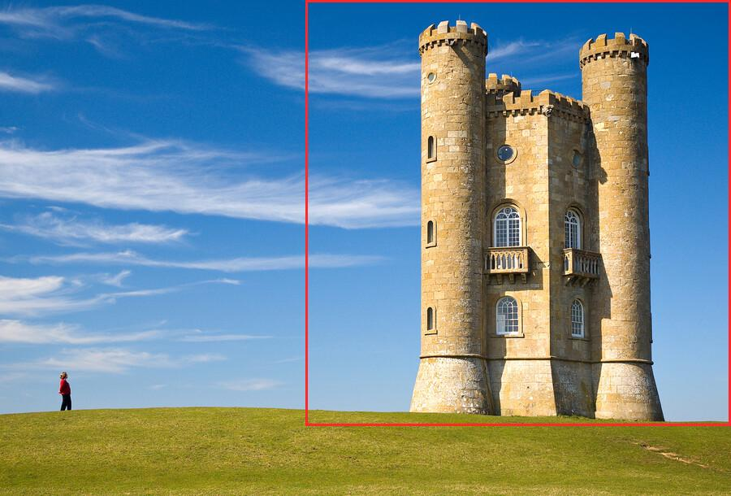
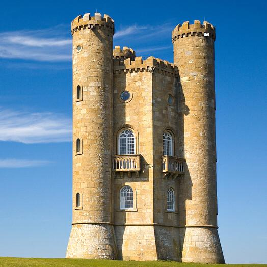

# Image analysis

Runs every analysis of `std.gfx.processing.analysis` on one picture: where its subject is, its colours and brightness, a BlurHash placeholder, perceptual hashes, and the keypoints that let a changed copy be recognised.

```bash
adm run --release gfx/analysis/main.adm -- photo.jpg out
```

The arguments are the picture and a folder for the pictures the analysis produces. Everything else is printed. The code is in [main.adm](main.adm), one function per section below.

The results on this page come from the sample picture, 900x610:

```bash
adm run --release gfx/analysis/main.adm -- gfx/analysis/images/sample.jpg gfx/analysis/images
```


## Subject

`saliency` turns a picture into a map of what stands out: white where the eye goes, black elsewhere.



`salientRegion` gives the square around that area, here 524x524 at (376, 0):



Cropping to it keeps the subject and drops the rest:



## Colours

`averageColor` is the mean of all pixels, `dominantColor` the most common colour (the sky, here), and `isOpaque` tells whether any pixel is transparent.

```
Colours
  average              rgb(112, 142, 150)
  dominant             rgb(2, 98, 171)
  opaque               true
```

## Brightness

`histogram` counts the pixels at each of the 256 levels of red, green, blue, alpha and luminance. The example prints luminance in sixteen ranges, darkest first:

```
Brightness (share of pixels per range of luminance)
    0- 15    0.1%
   16- 31    0.3%  #
   32- 47    1.0%  ###
   48- 63    2.3%  #######
   64- 79    8.6%  ############################
   80- 95   11.9%  ########################################
   96-111   11.1%  #####################################
  112-127   10.7%  ###################################
  128-143   11.7%  #######################################
  144-159   10.6%  ###################################
  160-175   10.3%  ##################################
  176-191   11.1%  #####################################
  192-207    4.9%  ################
  208-223    3.2%  ##########
  224-239    1.7%  #####
  240-255    0.5%  #
```

## Placeholder

`blurHash` packs a blurred version of the picture into about thirty characters, to show while the real one loads.

```
Placeholder
  BlurHash             USFi=XKSNI=B9lWYa{s.I7i]aeS*T3a}oJae
```

## Perceptual hashes

`hash` gives 64 bits that stay nearly the same when the picture is resized, recompressed or recoloured, so two files can be compared without their pixels. There are four algorithms. `similarity` is the share of equal bits between two pictures' hashes.

```
Perceptual hashes
  average              0008ccfcf9fdff00
  difference           3a3a09b12931f9f8
  perceptual           d91515eb44e27273
  wavelet              0008ccfcf9fdff00

Similarity to changed copies (perceptual hash, 1.00 is identical)
  half the size        1.00
  mirrored             0.47
  turned a quarter     0.41
```

A resized copy hashes the same. A mirrored or turned one does not: about half the bits differ, which is what two unrelated pictures score.

## Keypoints

`features` finds corners that are found again after the picture is scaled, turned, mirrored or cropped. The example asks for 500 and marks them:


`compare` matches two sets of keypoints and scores how much of what both pictures show agrees. It recognises the copies the hashes cannot:

```
Match with changed copies (keypoints, 1.00 is a full match)
  half the size        0.26  (130 keypoints agree)
  mirrored             0.85  (427 keypoints agree)
  turned a quarter     0.80  (399 keypoints agree)
  subject only         0.70  (329 keypoints agree)
```

## Image credit

`images/sample.jpg` is [Broadway tower edit.jpg](https://commons.wikimedia.org/wiki/File:Broadway_tower_edit.jpg) by Newton2 (cropped by Yummifruitbat), from Wikimedia Commons, scaled down to 900 pixels wide. The other pictures in `images/` are this example's output from it. All are under the [Creative Commons Attribution 2.5](https://creativecommons.org/licenses/by/2.5) licence, which is separate from the licence of this repository's code.
