# Canvas showcase

Draws one PNG per area of the `std.gfx.canvas` API. The images below are this example's output.

```bash
adm run gfx/canvas-showcase/showcase.adm                    # writes canvas-showcase/*.png
adm run gfx/canvas-showcase/showcase.adm -- out/ font.ttf   # another directory or font
```

Without a font file it uses an installed sans-serif font. The vertical text scene writes Japanese when a Noto CJK font is installed.

## Source files

| File | Contents |
|------|----------|
| [showcase.adm](showcase.adm) | The application: loads the fonts, draws each scene on a canvas and saves it. |
| [kit.adm](kit.adm) | What the scenes share: the palette, the fonts, a few shapes, captions. |
| [shapes.adm](shapes.adm) | Paths and strokes, borders, path booleans, morphing and trimming. |
| [paint.adm](paint.adm) | Gradients, patterns, image sampling, noise, mesh gradients. |
| [compositing.adm](compositing.adm) | Drawing state, clips, Porter-Duff operators, blend modes, effects, layers. |
| [text.adm](text.adm) | Single lines, vertical text, paragraphs. |
| [images.adm](images.adm) | Recorded pictures, sprites, mesh warps. |

## Scenes

### Paths and strokes

Fill rules, curves, rounded shapes, caps and joins, dashes, and strokes that keep their width under a transform. Source: `paths` in [shapes.adm](shapes.adm).

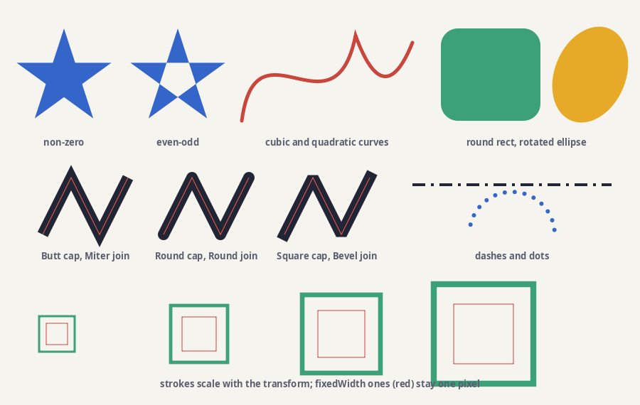

### Borders

Every line style, a width and paint per side, rounded corners. Source: `borders` in [shapes.adm](shapes.adm).

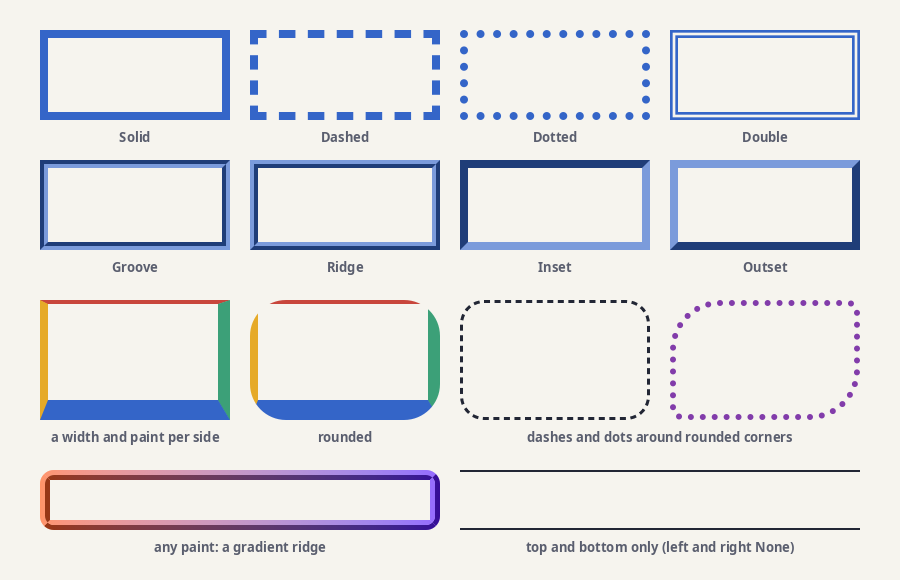

### Path booleans

Unite, intersect, subtract and xor on paths, text outlines included. Source: `booleans` in [shapes.adm](shapes.adm).

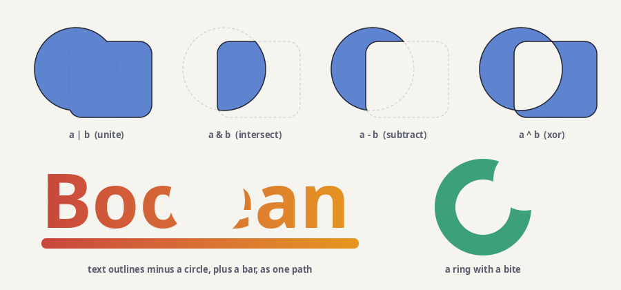

### Morph and trim

A square morphing into a star, and a curve trimmed to part of its length. Source: `motion` in [shapes.adm](shapes.adm).

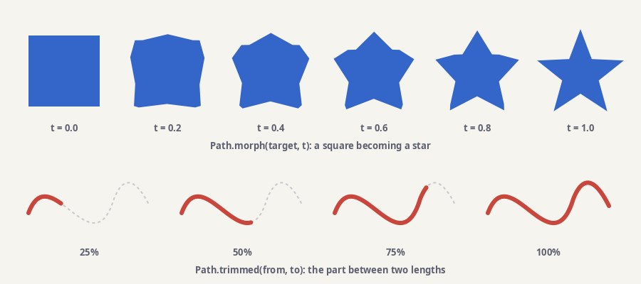

### Paint

Linear, conic and radial gradients, colour spaces, spreads, a pattern, image sampling, nine-slice. Source: `paint` in [paint.adm](paint.adm).

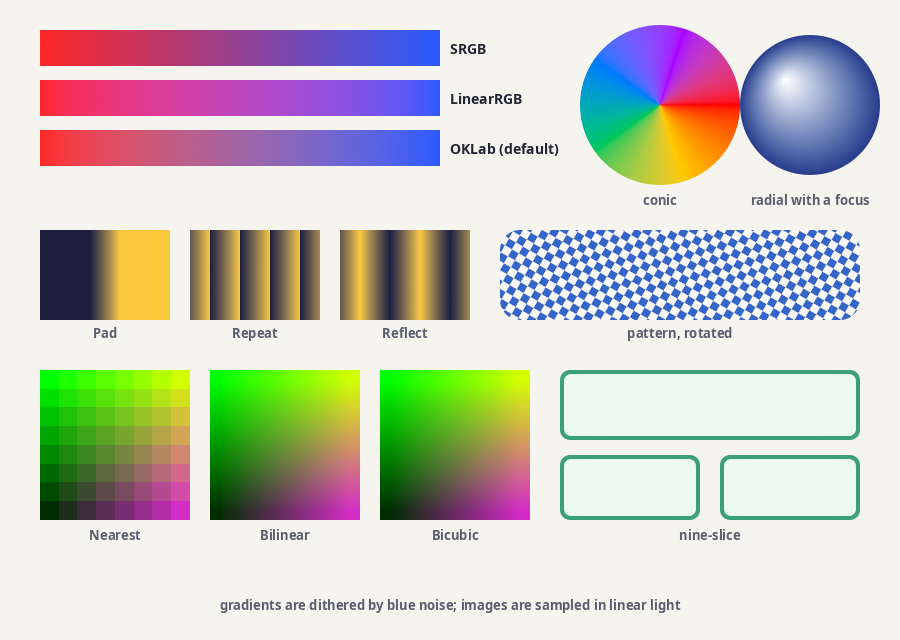

### Noise

Fractal noise through a list of colours. Source: `noises` in [paint.adm](paint.adm).

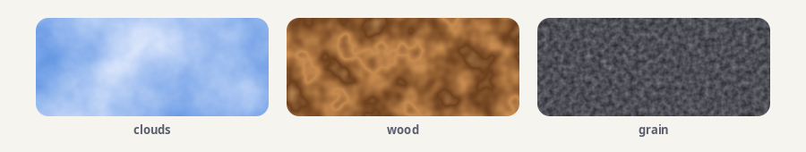

### Mesh gradients

Colours at the corners of a bendable grid, blended smoothly. Source: `meshGradients` in [paint.adm](paint.adm).

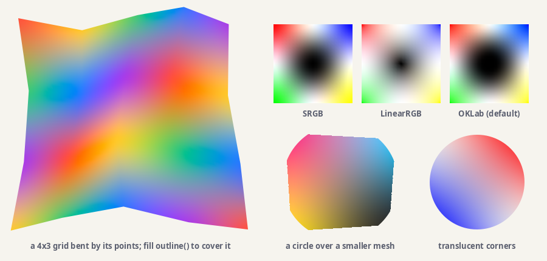

### State and compositing

Transforms, alpha, clips by path and by mask, hit testing, the Porter-Duff operators, blend modes. Source: `compositing` in [compositing.adm](compositing.adm).

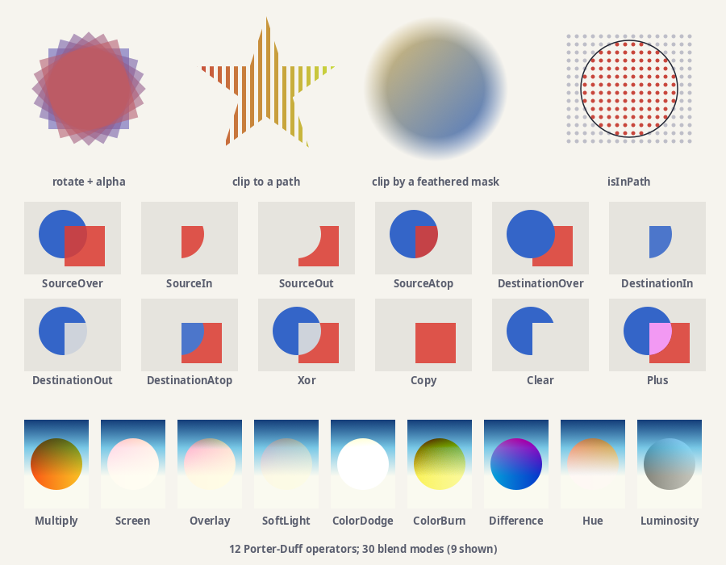

### Effects

Shadows, glows, outlines, blur, backdrop blur and colour adjustment on groups. Source: `effects` in [compositing.adm](compositing.adm).

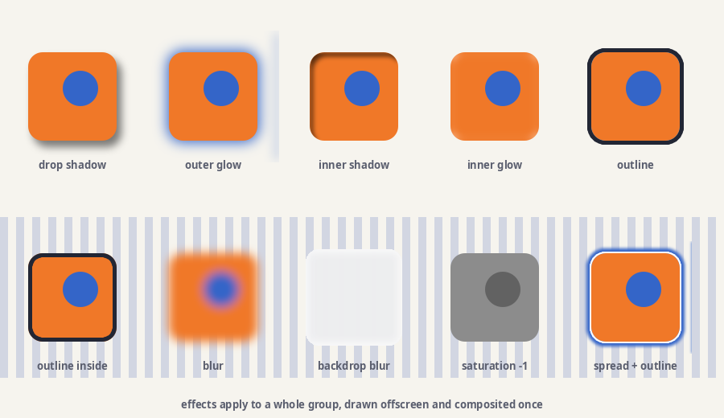

### Layers

A layer stack with a blend mode, an effect, a clipping layer and a masked folder. Source: `layers` in [compositing.adm](compositing.adm).

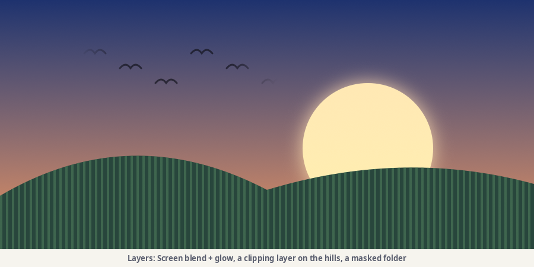

### Text

Filled, stroked, painted and clipped text, alignment, baselines, text on a path, hinting, measuring. Source: `text` in [text.adm](text.adm).

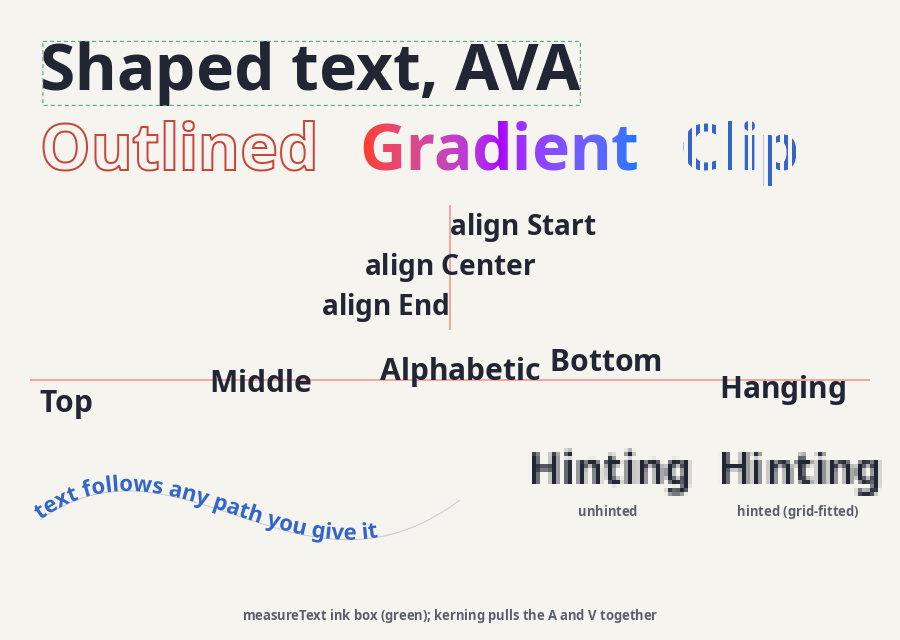

### Vertical text

Upright columns, baselines across a column, sideways runs. Source: `verticalText` in [text.adm](text.adm).

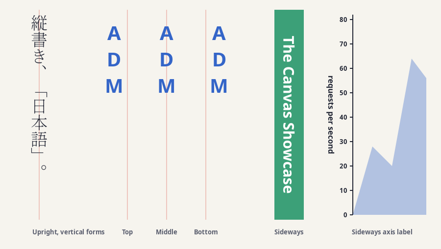

### Paragraphs

Wrapped spans of mixed sizes and colours, alignment, split words, line height, per-line boxes. Source: `paragraphs` in [text.adm](text.adm).

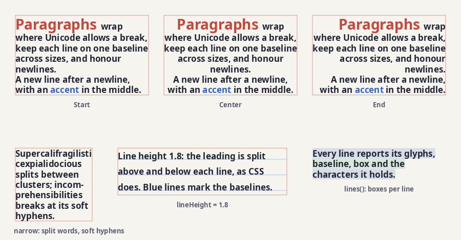

### Pictures

A recording replayed under transforms, used as a pattern, and hit-tested by tag. Source: `pictures` in [images.adm](images.adm).

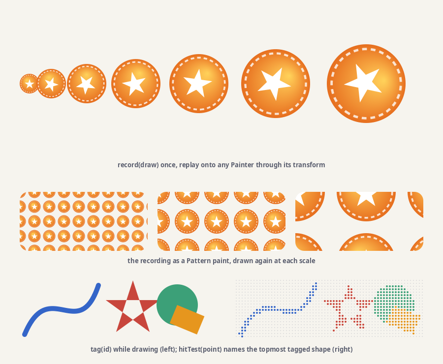

### Sprites

1500 sprites and a tile map from one sheet, each in one `drawAtlas` call. Source: `sprites` in [images.adm](images.adm).

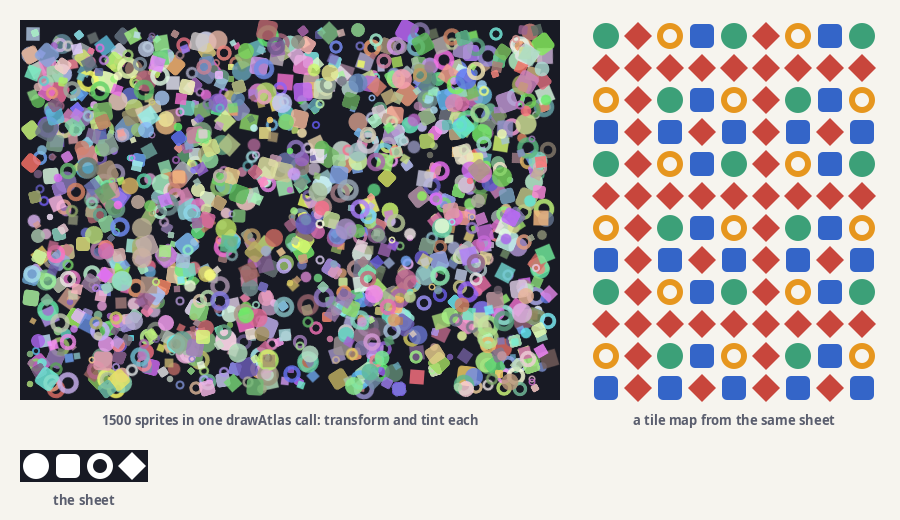

### Mesh warp

One image stretched onto bent grids of points. Source: `warps` in [images.adm](images.adm).

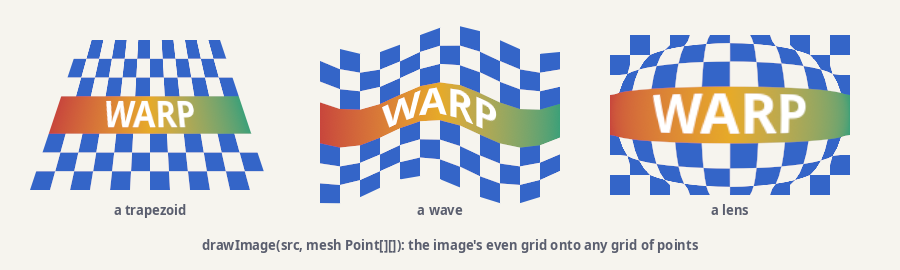
