# Image filters

Applies every filter of `std.gfx.processing.filters` to one picture and saves each result.

```bash
adm run --release gfx/filters/main.adm -- photo.jpg out
```

The arguments are the picture and a folder for the results, one file per filter. The picture is first scaled down to 300 pixels wide so the results stay small. The code is in [main.adm](main.adm).

A filter changes the picture it is given. Most take a strength: 0.0 leaves the picture alone, 1.0 is the full effect, and the ones that go both ways take -1.0 to 1.0.

The pictures on this page come from the sample:

```bash
adm run --release gfx/filters/main.adm -- gfx/filters/images/sample.jpg gfx/filters/images
```

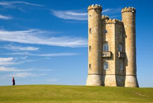

## Colour

| 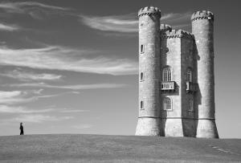 | 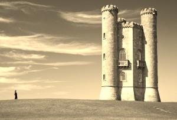 | 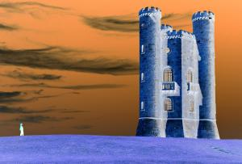 |
|:---:|:---:|:---:|
| `grayscale(img)`<br>Shades of gray | `sepia(img)`<br>The classic brown tone | `invert(img)`<br>Every channel inverted |

| 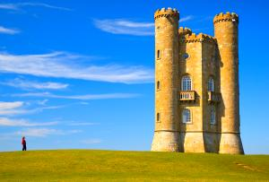 | 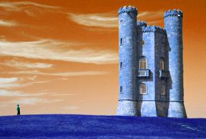 | 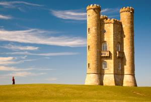 |
|:---:|:---:|:---:|
| `saturation(img, 0.8)`<br>Stronger colours; negative drains them | `hue(img, 0.5)`<br>Hues turned half way round the colour wheel | `temperature(img, 0.6)`<br>Warmer; negative is cooler |

| 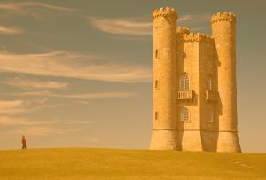 |
|:---:|
| `tint(img, orange, 0.5)`<br>Pulled half way towards one colour |

## Light

| 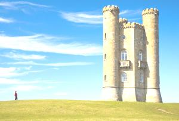 | 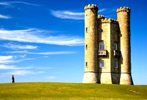 | 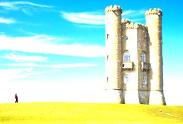 |
|:---:|:---:|:---:|
| `brightness(img, 0.3)`<br>Brighter; negative is darker | `contrast(img, 0.5)`<br>More contrast; negative is flatter | `exposure(img, 0.5)`<br>One stop brighter (1.0 is two stops) |

| 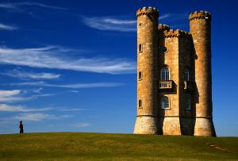 |
|:---:|
| `gamma(img, 2.0)`<br>Gamma 2.0: darker midtones; below 1.0 brightens |

## Detail

| 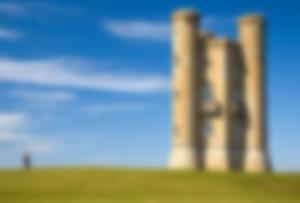 |  |
|:---:|:---:|
| `blur(img, 0.4)`<br>Gaussian blur | `sharpen(img, 1.0)`<br>Unsharp mask |

## Fewer colours

| 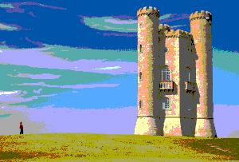 | 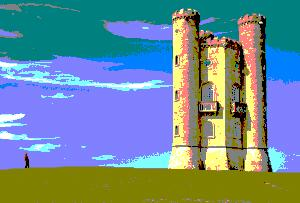 | 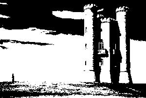 |
|:---:|:---:|:---:|
| `posterize(img, 4)`<br>Four levels per channel | `quantize(img, 27)`<br>At most 27 colours | `threshold(img, 0.5)`<br>Black below half luminance, white above |

## Pixels of your choice

|  | 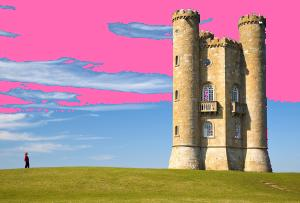 | 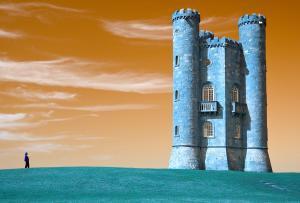 |
|:---:|:---:|:---:|
| `opacity(img, 0.5)`<br>Half transparent (saved as PNG) | `replaceColor(img, sky, pink, 70)`<br>Every pixel within 70 of a blue becomes pink | `mapPixel(img, swapRedAndBlue)`<br>A function of your own run on every pixel |

## Masks

Every filter takes a mask as its last argument, which limits it to part of the picture. Here `grayscale` runs through a circle with a soft edge, inverted so it covers everything but the circle:

```adm
let spot = new CircleMask(new Circle(216.0, 91.0, 85.0), 12.0)
spot.inverted = true
filters.grayscale(img, 1.0, spot)
```

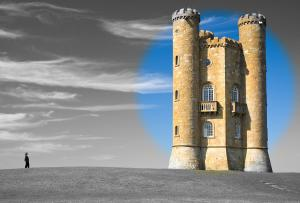

`std.gfx` has masks for rectangles, circles and polygons; a picture can be a mask too, its bright areas letting the filter through.

## Image credit

`images/sample.jpg` is [Broadway tower edit.jpg](https://commons.wikimedia.org/wiki/File:Broadway_tower_edit.jpg) by Newton2 (cropped by Yummifruitbat), from Wikimedia Commons, scaled down to 900 pixels wide. The other pictures in `images/` are this example's output from it. All are under the [Creative Commons Attribution 2.5](https://creativecommons.org/licenses/by/2.5) licence, which is separate from the licence of this repository's code.
