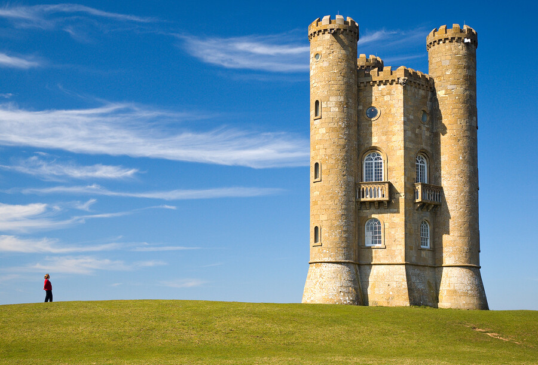
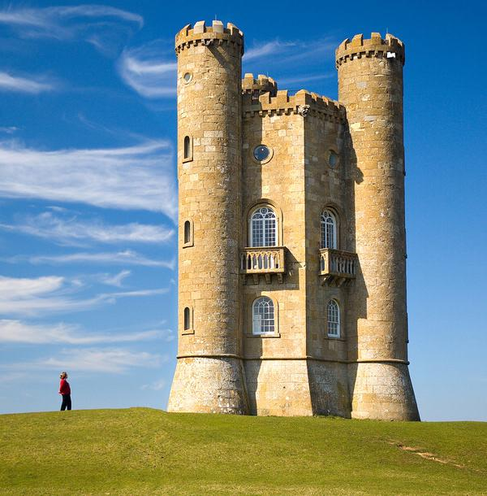

# Seam carving

Resizes an image with seam carving: instead of squashing the whole picture, it removes the paths of pixels that matter least, so the subject keeps its shape while the background gives.

```bash
adm run --release gfx/seam-carving/carve.adm -- photo.jpg narrow.jpg 500       # new width
adm run --release gfx/seam-carving/carve.adm -- photo.jpg small.jpg 500 300    # new width and height
```

The whole program is three calls in [carve.adm](carve.adm): `image.load`, `resize` with `ResizeMode.ContentAware`, and `save`.

## Before and after

The photo below went from 900 to 600 pixels wide:

```bash
adm run --release gfx/seam-carving/carve.adm -- gfx/seam-carving/images/before.jpg gfx/seam-carving/images/after.jpg 600
```

Before, 900x610:



After, 600x610. The tower and the person are as wide as before; the sky between them is what was removed:



## Image credit

`images/before.jpg` is [Broadway tower edit.jpg](https://commons.wikimedia.org/wiki/File:Broadway_tower_edit.jpg) by Newton2 (cropped by Yummifruitbat), from Wikimedia Commons, scaled down to 900 pixels wide. `images/after.jpg` is this example's output from it. Both are under the [Creative Commons Attribution 2.5](https://creativecommons.org/licenses/by/2.5) licence, which is separate from the licence of this repository's code.
