# Image transforms

Applies every transform of `std.gfx.processing.transform` to one picture and saves each result: mirroring, cropping, padding, trimming, resizing with each algorithm, and fitting into a box in each of the ten ways.

```bash
adm run --release gfx/transforms/main.adm -- photo.jpg out
```

The arguments are the picture and a folder for the results, one file per transform. The picture is first scaled down to 300 pixels wide so the results stay small. The code is in [main.adm](main.adm).

A transform changes the picture it is given. The pictures on this page come from the sample, 300x203 once scaled down:

```bash
adm run --release gfx/transforms/main.adm -- gfx/transforms/images/sample.jpg gfx/transforms/images
```


## Mirroring

| 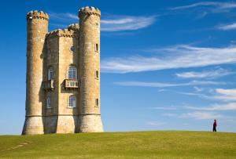 | 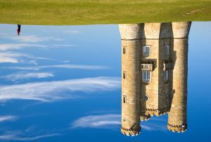 |
|:---:|:---:|
| `flip(img, Axis.Horizontal)`<br>Mirrored left to right | `flip(img, Axis.Vertical)`<br>Mirrored top to bottom |

## Cropping

`crop` cuts out a rectangle of your choice. `smartCrop` takes only a size and finds the subject by itself.

| 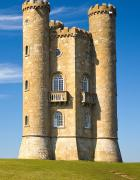 | 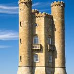 |
|:---:|:---:|
| `crop(img, window)`<br>A 140x180 window at (150, 10) | `smartCrop(img, 150, 150)`<br>150x150 around the subject |

## Padding and trimming

`pad` adds a border on every side: transparent, or of one colour. `trim` removes the transparent rows and columns around a picture, which undoes the transparent border: 340x243 back to 300x203.

| 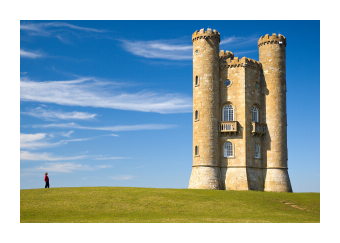 | 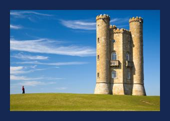 |
|:---:|:---:|
| `pad(img, 20)`<br>20 transparent pixels on every side | `pad(img, 20, navy)`<br>The same border in one colour |

## Resizing

`resize` takes the new size and an algorithm. The algorithms differ most when enlarging, so here each one enlarges the same 50x50 detail four times:

|  |  | 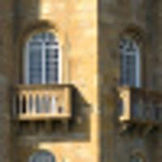 |
|:---:|:---:|:---:|
| `ResizeMode.NearestNeighbor`<br>Fastest; keeps hard pixel edges | `ResizeMode.Bilinear`<br>Fast and smooth | `ResizeMode.Bicubic`<br>Slower and sharper |

`ResizeMode.Area` averages the pixels each new pixel covers, which is the mode for shrinking. `ResizeMode.ContentAware` changes a picture's proportions by seam carving: it removes the paths of pixels that matter least, so the subject keeps its shape where the other modes squash it. Both pictures on the right are 180x203:

|  | 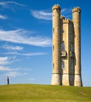 | 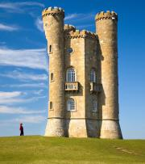 |
|:---:|:---:|:---:|
| `ResizeMode.Area`<br>A third of the size | `ResizeMode.Bicubic`<br>Narrowed to 180 pixels: squashed | `ResizeMode.ContentAware`<br>Narrowed to 180 pixels: the tower keeps its width |

## Fitting into a box

`fit` scales or crops a picture to a box, here a 200x200 square, in one of ten ways:

| 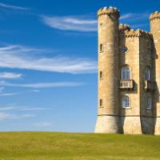 |  |  |
|:---:|:---:|:---:|
| `FitMode.Cover`<br>Fills the box, crops the overflow | `FitMode.Contain`<br>The whole picture inside the box | `FitMode.Stretch`<br>Stretched to the box |

|  | 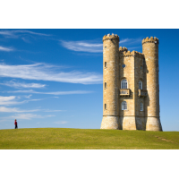 | 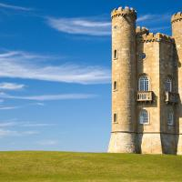 |
|:---:|:---:|:---:|
| `FitMode.ScaleToFill`<br>As Cover | `FitMode.ScaleToFit`<br>As Contain | `FitMode.CenterCrop`<br>The middle of the picture, not scaled |

| 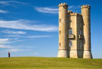 |  | 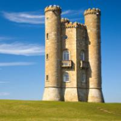 |
|:---:|:---:|:---:|
| `FitMode.FitWidth`<br>Scaled to the box's width: 200x135 | `FitMode.FitHeight`<br>Scaled to the box's height: 296x200 | `FitMode.SmartCrop`<br>Fills the box, cropped around the subject |

| 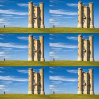 |
|:---:|
| `FitMode.Tile`<br>A 100x67 picture repeated to fill the box |

## Image credit

`images/sample.jpg` is [Broadway tower edit.jpg](https://commons.wikimedia.org/wiki/File:Broadway_tower_edit.jpg) by Newton2 (cropped by Yummifruitbat), from Wikimedia Commons, scaled down to 900 pixels wide. The other pictures in `images/` are this example's output from it. All are under the [Creative Commons Attribution 2.5](https://creativecommons.org/licenses/by/2.5) licence, which is separate from the licence of this repository's code.
