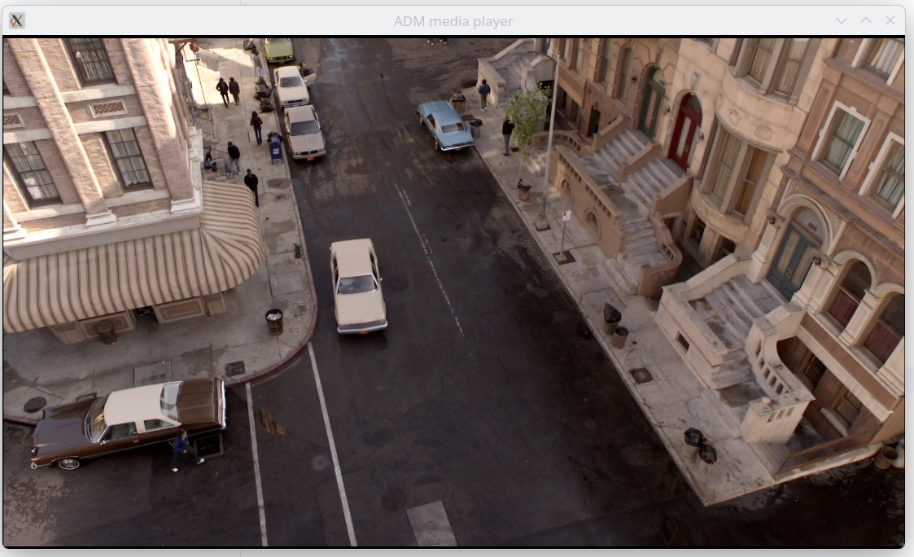
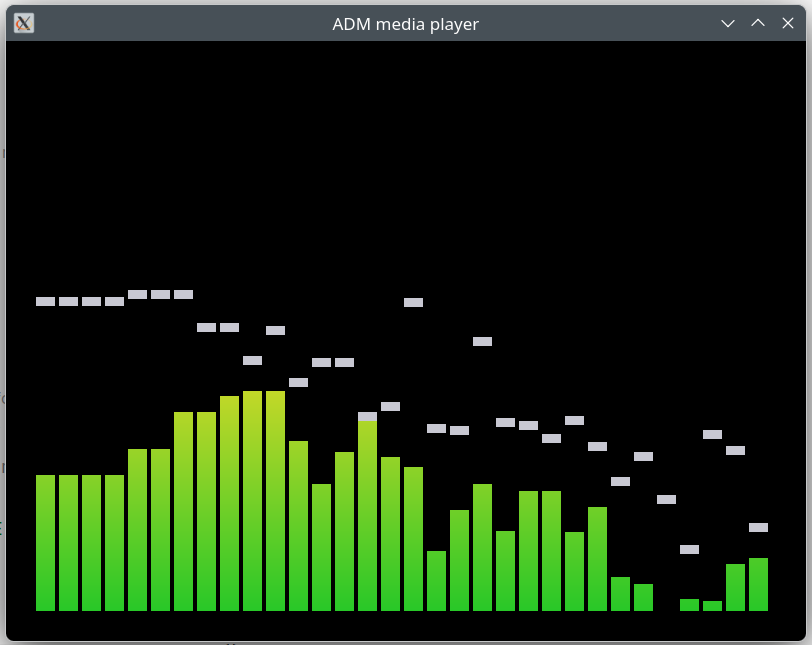

# Media player

Plays audio and video files and internet radio in a window, one after another. A video shows its picture; an audio file or a radio station shows level bars moving with the sound.

```bash
adm run --release media/media-player/player.adm -- song.mp3 clip.mp4
adm run --release media/media-player/player.adm -- ~/Music
adm run --release media/media-player/player.adm -- https://live.kissfm.ro/kissfm.aacp
```

Every argument is a file, a folder or an internet address. A folder adds every audio and video file in it, subfolders included; an address starting with `http://` or `https://` is a radio station, or a file on a server.

## Keys

| Key | Action |
|-----|--------|
| Space | Pause and resume |
| N, P | Next and previous item |
| Right, Left | Skip 10 seconds forward and back |

## Video

The player hands over the frame due at each moment, and the window draws it scaled to fit:



## Audio

With no picture to show, the player draws a visualizer: one bar per frequency band, each with a peak marker that holds for a moment and then drops.



## Internet radio

An internet radio station is an audio stream that never ends: the program connects to its address and plays what arrives. The player treats it as one more track, so stations and files mix in one playlist.

```bash
adm run --release media/media-player/player.adm -- https://live.kissfm.ro/kissfm.aacp
```

```
1 item(s) to play
playing https://live.kissfm.ro/kissfm.aacp
  KissFM: Pink - PLEASE DON'T LEAVE ME
```

- The address can be the stream itself or a playlist file (`.pls`, `.m3u`) that links to it, which is what most stations publish.
- A station sends its name when the connection opens and a line of text each time a new song starts. The player puts them in the track's title and artist and calls `onTitleChange`, where the example prints them.
- The player reads ahead into a buffer on a task of its own, so a slow network does not stutter the sound, and it connects again when a station drops the connection.
- A stream has no length and cannot be skipped through: the right and left keys do nothing while a station plays. N and P still move to the next and previous item.

## How it works

Everything is in [player.adm](player.adm):

- `MediaPlayer` from `std.media.player` holds the playlist and plays it on its own task. Sound goes to the default speaker.
- The program opens a window and draws one frame per turn of its loop: `player.picture()` gives the video frame due now, or nothing for an audio file, in which case it shows the image the visualizer draws into.
- Key presses from the window call `pause`, `play`, `next`, `previous` and `skip` on the player.
